<table>
<tr>
<td valign="top">

# 👋 Hi, I'm dbydd

## 🛠 Tech Stack

## 📊 GitHub Stats

<!--  -->

## 🏗️ Featured Projects

| Project | Language |
|---------|----------|
| [arceos-kern-crates-migrate](https://github.com/dbydd/arceos-kern-crates-migrate) | Rust |
| [axruntime](https://github.com/dbydd/axruntime) | Rust |
| [axhal](https://github.com/dbydd/axhal) | Rust |
| [xhci](https://github.com/dbydd/xhci) | Rust |
| [okx-rs-async](https://github.com/dbydd/okx-rs-async) | Rust |
| [cpp_string_tricks](https://github.com/dbydd/cpp_string_tricks) | C++ |
| [hidreport-nostd](https://github.com/dbydd/hidreport-nostd) | Rust |
| [polars-trading](https://github.com/dbydd/polars-trading-continue-working) | Python |

## 📫 Contact

</td>
<td valign="top" align="right">

## 🔥 Recent Activity

</td>
</tr>
</table>

---

⭐ From [dbydd](https://github.com/dbydd)
